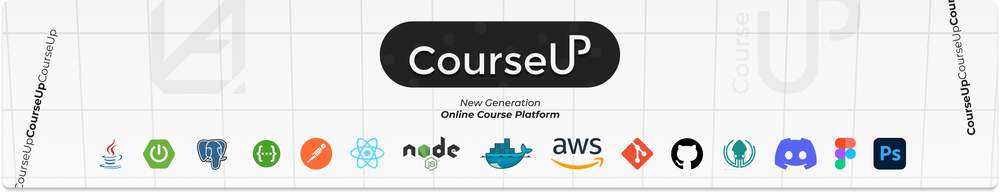

# CourseUp

***New Generation Online Course Platform***

 

**CourseUp** is an advanced online course platform built with a robust tech stack that ensures scalability, performance, and a seamless user experience. The backend is powered by **Java Spring Boot**, with **Hibernate** and **JDBC** handling database interactions in **PostgreSQL**. The frontend, developed using **React** and **JavaScript**, provides a dynamic and responsive interface.

To enhance development efficiency and project management, tools like **Lombok**, **Maven**, **Git**, and **Postman** are utilized. **Swagger** is integrated for API documentation, ensuring easy collaboration and testing. The platform's deployment is managed with **Docker** and hosted on **AWS**, providing a reliable and scalable infrastructure.

For design and UI/UX, **Figma** and **PhotoShop** are employed, ensuring that CourseUp is not only functional but also visually appealing. **Node.js** is also part of the stack, likely supporting additional services or real-time features.

 


## Requirements
- Java 17 or newer
- Node.js 18+ and npm
- PostgreSQL
- Docker (Optional, if you want to use Docker for deployment)
- AWS S3 (for file uploads)
- Git

### Installation
```sh
git clone https://github.com/zahidayturan/course-up-app.git
cd course-up-app

cd course-up-backend
mvn clean install

Edit the course-up-backend/src/main/resources/application.properties file according to your own information

cd ../course-up-frontend
npm install

Create and edit the frontend/.env file as follows:
REACT_APP_API_BASE_URL=http://localhost:8080 (probably)
REACT_APP_S3_BUCKET_NAME=your_bucket_name

Create a database in PostgreSQL
CREATE DATABASE courseup;

cd course-up-backend
mvn spring-boot:run

cd ../course-up-frontend
npm start

Visit http://localhost:3000 in your browser to explore CourseUp.

Running with Docker if u want (Optional)
```
If you encounter any issues during setup, please report an issue. Feel free to adjust any placeholders or specific details as needed!


## How can I support developers?
- Star this GitHub repo
- Create pull requests, submit bugs, suggest new features or documentation updates
- Follow my work